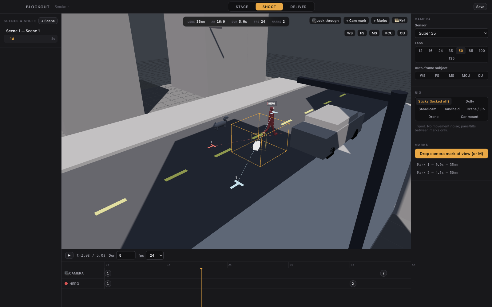

# Blockout

**A desktop previs tool for AI-native filmmaking.** Stage a scene in minutes, choreograph camera and character blocking against marks — the way real sets work — and export motion-reference packages (video + depth pass + stills + a tailored prompt) that AI video generators like **Seedance 2.0, Veo 3.1, Kling, LTX 2.3, and Wan 2.2** can follow precisely.



## Why

Video generators produce dramatically better results when you hand them an unambiguous motion reference: a rough 3D render showing exactly the camera move and character blocking you want. Blockout is the fastest path from "I can see the shot" to "the generator can't misread it." It is deliberately **not** a 3D art tool — grey-box mannequins and vehicles at real-world scale, real lens math, and choreography tools are the whole product. Fidelity target: *unambiguous, not beautiful.*

## The 60-second workflow

1. **STAGE** — drag in an environment kit (city street, nightclub, car interior…), place people/animals/vehicles/furniture from the library, label your subjects ("THIEF", red).
2. **SHOOT** — select an actor, press `M`, click the floor to drop numbered marks; the actor walks them on your timeline. Frame the camera (or click **MS** and it auto-frames a medium shot at your lens), drop camera marks, pick a rig — dolly, steadicam, handheld, crane, drone, car-mount. Scrub, retime, play.
3. **DELIVER** — pick your generator, click **Export shot package**. You get:

```
Shot-1A/export-…/
├── 1A_reference.mp4    # the motion reference (deterministic render)
├── 1A_depth.mp4        # depth pass for ComfyUI control workflows
├── 1A_normal.mp4       # optional normal pass
├── stills/             # frame at every camera mark + first/last + top-down blocking diagram
├── prompt.txt          # generated from your actual blocking, tailored per generator
├── comfyui-workflow.json  # pre-wired depth-conditioning workflow (Wan/LTX profiles)
├── metadata.json       # machine-readable marks/lenses/timings
└── README.txt
```

Plus per-scene tools: **animatic export** (all shots stitched), **contact sheet**, and **Blender handoff** (.glb with the animated camera + a one-click import script).

## Features

- **Real camera optics** — Super 16 / Super 35 / Full Frame / 65mm sensors, real focal lengths, keyframable zoom (dolly-zoom capable), rack focus, aspect masks (16:9, 9:16, 2.39:1, 4:3, 1:1), rule-of-thirds + action-safe overlays.
- **Marks-based choreography** — one mental model for camera and actors; editable paths, per-mark hold/easing, gaits (walk/jog/run/sit/crouch/…), and **speed sanity warnings** ("this walk implies 6 m/s — try jog").
- **Coverage model** — a scene owns the blocking; shots own cameras. Shoot the same action from five angles without re-blocking.
- **Reference underlay** — ghost any existing video (including depth maps) over the viewport, timeline-synced, to match its blocking by eye.
- **Deterministic exports** — the timeline is stepped at exact fps and rendered offline; the same project exports byte-identical frames on every run. Playback performance never affects output.
- **Data-driven generator profiles** — durations, resolutions, reference modes, and prompt templates per model; adding a new generator is a config edit.
- **Git-friendly projects** — a project is a folder of pretty-printed, stable-key-order JSON. Diff it, branch it, review it.

## Install

**Download** a release DMG (macOS) from GitHub Releases, or build from source:

```bash
git clone <this repo>
cd blockout
npm install
npm run dev        # development, hot reload
# or
npm run build && npm start   # production build
```

Requirements: Node 22+, and ffmpeg for exports (bundled via `ffmpeg-static` when packaged; falls back to system `ffmpeg` — `brew install ffmpeg`).

## Scripts

| Command | What it does |
|---|---|
| `npm run dev` | Run with hot reload |
| `npm run typecheck` / `npm run lint` | Strict TS + ESLint |
| `npm test` | Engine unit tests (Vitest) |
| `npm run smoke` | Build + full end-to-end smoke: boots the app, stages a scene, exports a real package, verifies it with ffprobe, checks byte-determinism |
| `npm run package` | Build a macOS DMG (`release/`) |

## Sharing builds

`npm run package` produces an unsigned DMG. For your own machines, right-click → Open bypasses Gatekeeper. For wider distribution, set a Developer ID `identity` and notarization in [electron-builder.yml](electron-builder.yml).

## Project structure

See [docs/DESIGN.md](docs/DESIGN.md) (product + architecture), [docs/ROADMAP.md](docs/ROADMAP.md) (build plan + QA program), and [AGENTS.md](AGENTS.md) (how AI agents should build/run/modify this app). The deterministic core lives in `src/engine/` — pure TypeScript, no DOM, fully unit-tested; `state(t)` is a pure function shared by playback, video export, stills, and glTF baking.

## License & assets

MIT. All 3D assets are procedurally generated in code — no external asset licenses involved.
