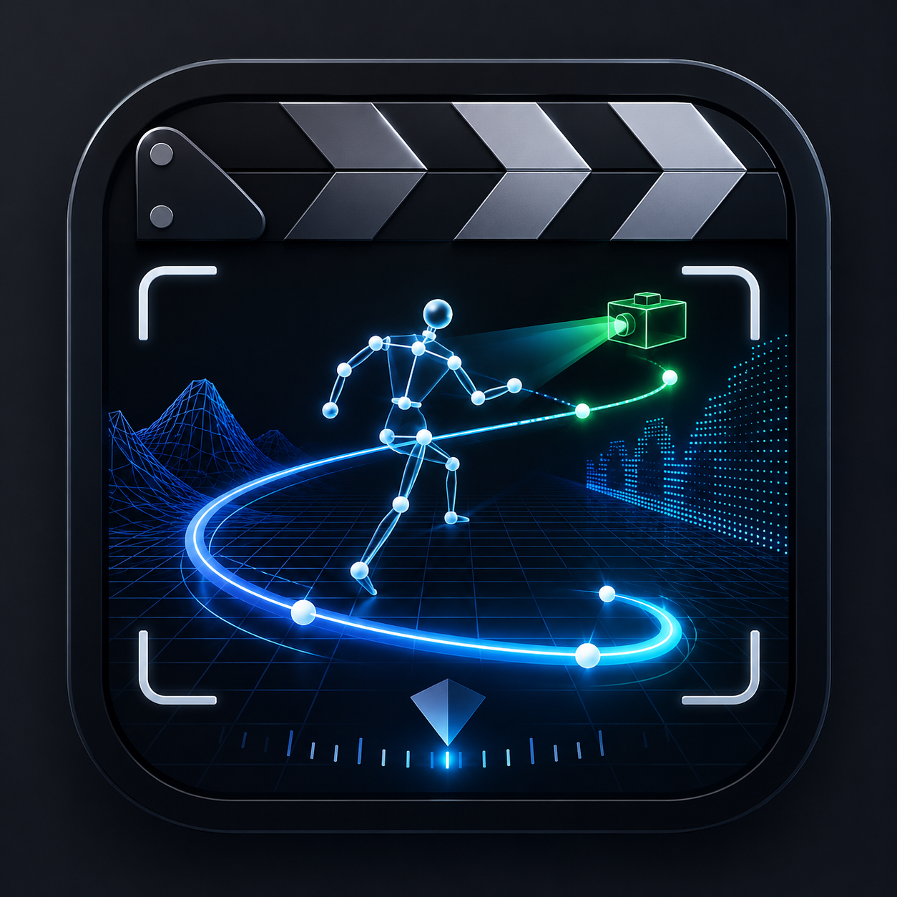

# Three-App Windows Workflow Handbook

**Motion Previs Studio, Blockout, and Stem Studio**

**Previs, animation, picture lock, and sound-finishing SOP**

**Original applications:** Sam Wasserman / Wasserman Productions

**Document status:** Maintainer review draft
**Edition:** Revision 05 - 2026-07-14

| Blockout | Motion Previs Studio | Stem Studio |
|---|---|---|
|  |  |  |

## Purpose

This handbook explains how to use three independent open-source filmmaking applications, one optional external generative-video stage, and an external editor as one honest, file-based production workflow on Windows 11:

1. Motion Previs Studio measures an existing performance and camera reference.
2. Blockout uses that reference to author and render the actual grey-box scene, performer, prop, vehicle, and camera animation.
3. When generative finishing is selected, an external service such as Higgsfield turns approved Blockout and Motion references into rendered shots.
4. An external editor assembles the approved shots into exact picture lock.
5. Stem Studio separates the married picture-lock soundtrack into Dialogue, Music, and SFX.
6. The external editor performs the final creative balance and movie export.

The applications do not share one native project file. Motion Previs has a supported reference-media handoff to a running Blockout project. Every later boundary uses versioned ordinary media files. Higgsfield, Seedance, Kling, and Wan are not features of the three applications and are not covered by their Apache-2.0 source licenses.

## What was accomplished

The Windows program established a complete Windows 11 x64 production path while preserving the projects' open-source lineage and existing macOS behavior:

- Three native Windows desktop applications and installer workflows from one cross-platform codebase per project.
- Portable project and production-package paths across Windows and macOS.
- Audited, packaged media tools and pinned analysis/runtime assets.
- Health-checked Motion Previs-to-Blockout reference transfer.
- Managed Stem Studio runtime with licensed public Windows production modes.
- Cooperative cancellation and full process cleanup across encoders, downloaders, runtime setup, and model workers.
- Packaged MCP bridges for agent-assisted work with explicit human review boundaries.
- Native Windows and cross-platform automated checks, open-source notices, and release provenance.
- Two complete dramatic 90-second 720p films - *The Twelfth Shadow* and *Signal Run* - with exact media, generation-cost, provenance, and technical-QC records.

### How it was achieved

Each application remained an independent Electron codebase. Shared engineering principles were applied consistently:

- **Paths:** portable manifests store relative names; live application calls may use validated machine-local paths.
- **Media:** each application resolves its packaged FFmpeg and FFprobe pair explicitly and owns process shutdown.
- **Control:** localhost discovery and health checks separate application availability from stale state files.
- **Cancellation:** cleanup starts only after the responsible process has closed.
- **Packaging:** Windows binaries are built natively from clean dependency installs.
- **Compliance:** application licenses, NOTICE files, model notices, media-component obligations, and source provenance remain visible.
- **Evidence:** acceptance depends on files, media probes, frame counts, sample alignment, and human review rather than a success message alone.

## Honest boundary map

| Stage | Application or tool | Contribution | Boundary |
|---|---|---|---|
| Performance measurement | Motion Previs Studio | Pose, depth, camera, edges, masks, optical flow, OpenPose, prompts | Analyzes an existing source; does not invent performance |
| Animation authoring | Blockout | Grey-box geography, performers, props, vehicles, actions, camera, clean media | Authors the visible animation; reference handoff is not retargeting |
| Generative animation | External Higgsfield service and selected hosted models | Converts approved stills, motion references, control media, and prompts into rendered shots | External paid service; not part of the three apps or their open-source licenses |
| Picture assembly | External editor | Shot order, source ranges, titles, captions, sound elements, exact picture lock | File handoff; not a hidden feature of the three applications |
| Sound separation | Stem Studio | Dialogue, Music, SFX, Married, optional multitrack delivery | Processes the approved married source once |
| Final finish | External editor | Creative rebalance, sync review, captions, master export | Human editorial approval remains required |

## Delivery contract

Set the delivery contract before creative work. The completed two-film walkthrough uses:

| Property | Recommended contract |
|---|---|
| Picture | H.264 High profile, progressive yuv420p, 1280 x 720 |
| Frame rate | 24 fps |
| Audio | AAC stereo at 48 kHz for final movie |
| Stem delivery | PCM 24-bit WAV, stereo, 48 kHz |
| Timing | Explicit scene and shot durations with an exact final frame count |
| Identity | Stable versioned names for every source, package, scene, shot, and output |

Use 1920 x 1080 only when the project, provider, budget, and review schedule explicitly require it. The 720p profile is the measured walkthrough contract, not a draft compromise.

## Production folder contract

Use a portable project root with one purpose per folder:

```text
PROJECT_ROOT/
  source/              approved reference and married-source media
  motion-packs/        versioned Motion Previs Production Packs
  blockout-projects/   complete .blockout project folders
  blockout-exports/    versioned clean/reference/depth media
  generation/          prompts, references, provider receipts, and rendered shots
  edit/                external editor project, EDL, picture lock
  stem-outputs/        one version per source and quality decision
  final/               final movie, captions, and delivery notes
  qa/                  media probes and publication-safe reports
```

Do not put machine-local control data, temporary runtime files, or private source notes into this tree.

## Human end-to-end SOP

### Phase 1 - Plan a shot-sized story

1. Write a logline, beginning, escalation, turn, and ending that can read in grey-box staging.
2. Define the picture, frame rate, audio, and exact-duration contract.
3. Create an edit decision list with one row per intended story range.
4. Give every scene and shot a stable ID.
5. Decide which beats require an existing performance reference.
6. Use short continuous reference clips with no internal edit.
7. Build a sound plan for dialogue, music, effects, and one final married source.
8. Confirm that source-media rights and repository-asset permissions are documented.

**Accept when:** scene durations sum to the delivery target and every story beat maps to an intended Blockout scene or shot.

### Phase 2 - Measure performance in Motion Previs Studio

1. Import the approved reference clip.
2. Confirm the visible source and select one continuous range.
3. Set project, scene, shot, intent, and Actor motion, Camera only, or Full scene.
4. Choose only the pose, depth, camera, edges, masks, normals, optical-flow, or OpenPose layers needed downstream.
5. Run analysis.
6. Review the beginning, action apex, and end of every required layer.
7. Export a versioned Production Pack.
8. Open the ZIP and verify portable relative filenames and required content.

**Accept when:** the selected layers are visually coherent and the complete package can move independently of the source workstation.

### Phase 3 - Hand off the reference to Blockout

1. Launch Blockout and open the intended destination project.
2. Confirm Motion Previs reports live Blockout health.
3. Send the approved Reference or Depth layer.
4. Confirm the clip is copied into the project and visible as a synchronized underlay.
5. Save and reopen the Blockout project.

**Accept when:** the reference persists inside the destination project and stays synchronized after reopen.

> The handoff transfers approved media. It does not create a character rig, retarget a skeleton, or author the final Blockout animation.

### Phase 4 - Author animation in Blockout

1. Build readable geography and label story-critical entities.
2. Set scene and shot duration, frame rate, aspect ratio, and camera before choreography.
3. Add actions, gaits, explicit timed marks, and prop movement.
4. Use the reference to match important timing rather than copying it mechanically.
5. Scrub first, midpoint, and final frames.
6. Play the entire shot and correct sliding, popping, collisions, subject loss, and camera problems.
7. Use separate scenes for sequential story beats.
8. Use additional shots for alternate coverage of the same underlying action.
9. Save after every approved beat.
10. Export a clean or reference MP4 for every motion-bearing source range.

**Accept when:** the selected source ranges contain visible authored motion and their scene, shot, duration, and output names match the edit decision list.

### Phase 5 - Generate rendered animation externally

Skip this phase when grey-box Blockout media is the intended final picture.

1. Freeze one approved prompt, first frame, motion reference, control set, aspect, and duration per shot.
2. Record the provider, model, quoted credits, and source hashes before submitting.
3. Run one bounded pilot before committing the complete shot list.
4. Check the result against a continuity bible and semantic coverage matrix containing every required subject count, prop state, vehicle state, action, title payoff, and `must land` condition.
5. Play the complete shot, then inspect dense samples at least twice per second and full-resolution frames on both sides of every edit boundary.
6. Treat exact counts, hero-prop silhouette, vehicle identity, generated text, and monotonic threat position as hard invariants when the story depends on them.
7. Require every essential transfer or transition - entering a vehicle, boarding an aircraft, handing off or retrieving a prop, or crossing a threshold - to appear on screen or have an unambiguous motivated cut.
8. Preserve every accepted result with its prompt, receipt, model name, cost, checksum, incoming state, and outgoing state.
9. Regenerate only the failed shot or tail; do not spend against an unreviewed full batch.
10. Normalize accepted shots to the locked frame rate, dimensions, color format, and exact duration before editing.

**Accept when:** every rendered shot satisfies its semantic coverage row, continuity invariants, action-completeness gate, dense visual review, deterministic local media identity, recorded provider/model/cost provenance, and no undocumented dependence on a private workstation path.

> **Open-source boundary:** the three applications remain open-source projects. Hosted Higgsfield generation and the Seedance, Kling, and Wan models are external services or models with their own terms. Their outputs and receipts must be disclosed separately from the application licenses.

### Phase 6 - Build exact picture lock externally

1. Import only approved Blockout clean or reference MP4 sources.
2. Apply explicit source in and out ranges from the edit decision list.
3. Do not concatenate repeated coverage when the story requires time to advance.
4. Add titles, captions, dialogue, music, and effects on separate tracks.
5. Confirm the story remains understandable with sound muted.
6. Export the exact final frame count.
7. Provide one approved stereo married soundtrack at 48 kHz, embedded or separately conformed to the same start and end.
8. Record the editor project version, source list, and final hashes.

**Accept when:** picture lock has the exact dimensions, frame rate, duration, and frame count, with no missing media and one clearly identified married source.

### Phase 7 - Separate the soundtrack once in Stem Studio

1. Load the approved picture lock or its exact conformed married WAV.
2. Confirm it is not an earlier Dialogue, Music, SFX, Married, or multitrack output.
3. Run Fast for the first editorial review.
4. Run High into a new version only when the comparison is justified.
5. Record dialogue-polish state before processing.
6. Confirm four aligned WAVs are created.
7. Verify channel count, sample rate, sample count, and duration.
8. Sum Dialogue + Music + SFX and compare with Married.
9. Audition Married, Dialogue, Music, and SFX with solo and mute states cleared and verified.

**Accept when:** one source identity leads to one clean output version, objective alignment passes, and a human editor has recorded the quality decision.

### Phase 8 - Finish and publish

1. Return Dialogue, Music, and SFX to the external editor at timeline start.
2. Keep Married muted as a reference.
3. Perform the creative rebalance.
4. Verify sync at the beginning, midpoint, critical events, and final frame.
5. Export the final picture and audio contract.
6. Probe duration, frame count, streams, dimensions, frame rate, channel count, and sample rate.
7. Run black-frame, freeze, silence, loudness, and motion checks.
8. Review every unexpected interval rather than suppressing the warning.
9. Play the complete final file in a fresh player.
10. Publish only artwork, documentation, and evidence that passed the privacy review.

**Accept when:** objective delivery checks pass and the designated human approver separately accepts picture, sound, and story.

## Animation SOP

### Design motion that can be proved

- Give every animated beat an intentional opening state, meaningful change, and final state.
- Lock shot duration before adding action or camera timing.
- Use separate Blockout scenes for sequential events.
- Inspect deterministic samples at the beginning, midpoint, and final frame.
- Verify the exported clean MP4, not only the live viewport or GLB.
- Confirm motion independently with frame-change analysis over the declared source range.

### Build dramatic clarity in grey box

1. Establish geography with a wide or strong directional frame.
2. Introduce a principal subject with a readable label or color.
3. Escalate through movement, obstruction, pursuit, reveal, or camera compression.
4. Use camera change only when it advances story information.
5. Hold long enough for the audience to read the turn.
6. End on a visually distinct state that resolves or reframes the opening.

### Convert control material into generative shots

1. Use the Blockout frame to lock geography, lens intent, screen direction, and subject placement.
2. Use Motion Previs control media only for the movement or camera behavior it actually proves.
3. Write one action, one camera behavior, and one continuity constraint per prompt before adding style language.
4. Pin the lead character, wardrobe, environment, weather, time of day, and forbidden changes across the shot list.
5. Preserve accepted last frames when they provide the cleanest continuity reference for the next shot.
6. Maintain a handoff ledger for incoming and outgoing pose, screen direction, location, time of day, object-in-hand, wardrobe, damage, subject count, and vehicle state.
7. Treat malformed hands, identity drift, duplicate people, teleportation, missing action, mutable props or vehicles, generated glyphs, flicker, and unplanned cuts as shot failures even when the model reports success.
8. Label any intentional surreal morph, geography compression, or time jump in the edit plan so reviewers do not mistake it for an unplanned continuity break.
9. Keep every provider result immutable; normalize copies for the edit and retain source hashes.

### Control cost with a pilot and model mix

The completed walkthrough used a hard cap of 450 credits:

- one 60-credit Seedance pilot established the quality bar before the full run;
- one 0.15-credit character master established *Signal Run* identity;
- 15 Kling 3.0 operations consumed 225 credits;
- two Seedance 2.0 operations consumed 70 credits;
- two Wan 2.7 operations consumed 24 credits;
- total spend was 379.15 credits, leaving 70.85 credits below the cap.

This is a production record, not a future price quote. Provider pricing can change. Always obtain a current quote, cap the run before submission, and use the lowest-cost model that passes the shot's actual continuity and motion requirements.

### Avoid common animation failures

| Failure | Prevention |
|---|---|
| Foot sliding or implausible speed | Review time, distance, gait, and the first/mid/final poses. |
| Character pops to an old transform | Remove stale time-zero marks and rebuild the opening state. |
| Story repeats instead of advancing | Put sequential beats in separate scenes or use explicit nonoverlapping source ranges. |
| Camera loses the subject | Check camera marks, focal length, headroom, lead room, and the complete move. |
| Export proves only layout | Use clean/reference MP4 as the motion master; treat GLB as layout and camera support. |
| Static presentation passes as animation | Require per-range frame-change evidence and complete playback. |
| Provider reports success but the shot is unusable | Review the complete result for anatomy, identity, geography, camera continuity, flicker, and final-frame stability before acceptance. |
| A necessary transfer happens off screen | Add a boarding, handoff, retrieval, or threshold insert; do not bridge the gap by assuming teleportation. |
| A title premise or exact count is missing | Treat the premise as a hard semantic gate and use a locked plate or controlled composite when generation cannot hold it. |
| A threat, prop, or vehicle resets at an edit | Compare frames immediately before and after every boundary and regenerate the smallest failing bridge. |
| Pseudo-text or unstable glyphs survive | Run a text-like-artifact pass on signs, screens, vehicles, and architecture; mask, replace, or regenerate the affected range. |
| Generation cost grows without a quality decision | Stop after the bounded pilot, set a hard cap, and approve each model tier against the shot rather than the brand name. |

## Final lesson - two dramatic 90-second films

The walkthrough produced two distinct capstones so the playbook could be tested against more than one visual and audio strategy:

| Film | Dramatic purpose | Three-app contribution | Final identity |
|---|---|---|---|
| *The Twelfth Shadow* | Maritime mystery built around a beacon, a warning, and an authored end fade | Motion measured shot-sized movement, Blockout supplied spatial and camera control, external generation rendered picture, Stem receives the locked married soundtrack | `The-Twelfth-Shadow-Generative-90s-720p.mp4` - SHA-256 `ff22739c92b0983a1c5514108bf371a69cc3a94faaf5a32aa2cee13d813aa296` |
| *Signal Run* | Pursuit thriller organized around a courier, handoff, extraction, and timed impacts | Motion measured action, Blockout supplied control frames and reference shots, external generation rendered picture, Stem receives the original procedural married source | `Signal-Run-Generative-90s-720p.mp4` - SHA-256 `6c1464c872b3e9f4702388938fccaed877cadf62b83edcd876b597df02173a9c` |

Both masters are exactly 90.000 seconds, 2,160 frames, 1280 x 720, 24 fps, H.264 High-profile yuv420p with 48 kHz stereo AAC. The final technical ledger passed 32 of 32 checks across media identity, stream structure, timestamps, decode, duplicate/freeze detection, loudness, contact-sheet reproducibility, and evidence hashes. *The Twelfth Shadow* contains one intentional source-authored 0.375-second black end fade; it is not a dropped shot.

### Creative continuity review and lesson disposition

The technical masters and three-application replay are complete, but the dense visual review does **not** approve either film as a polished literal narrative release. The files remain useful, reproducible workflow test masters and reveal where the animation SOP needed stronger gates.

| Film | Review disposition | Highest-severity findings | Targeted repair |
|---|---|---|---|
| *Signal Run* | Revision required for literal continuity | The courier stays on the ground as the helicopter leaves, then exits it in the desert; the helicopter changes model during the same flight | Add a visible boarding bridge and regenerate the airfield-to-desert aircraft shots from one locked reference |
| *The Twelfth Shadow* | Revision required for the planned premise and climax | The crowd exceeds twelve, the titular twelfth-shadow beat is absent, and the wave disappears before the planned impact | Replace the count-dependent formation, title-payoff, and finale ranges; use a locked plate or controlled composite where exact geometry is essential |

The audit also found mutable keys, vehicles, markings, and generated glyphs. These findings led directly to the semantic coverage matrix, continuity handoff ledger, action-completeness gate, dense two-frames-per-second review, edit-boundary comparison, text-like-artifact scan, and explicit surreal-transition label added in Revision 05. A human director/editor must still decide whether to keep the current films as experimental workflow artifacts or authorize targeted pickups.

### Signal Run original audio

The *Signal Run* married soundtrack was synthesized specifically for this walkthrough from fixed-frequency oscillators, seeded brown and white noise, deterministic envelopes, filters, delays, fades, and loudness control. It contains no downloaded, stock, sampled, recorded, or paid audio. The pinned PCM source is 24-bit, 48 kHz stereo, exactly 4,320,000 samples per channel and 90.000 seconds. The completed Stem Studio separation outputs are derivative test artifacts; the procedural generator must not be described as Stem Studio output.

## Agent-assisted workflow

### Motion lane

1. Discover live state.
2. Import source, set range, mode, and approved settings.
3. Run analysis and poll to Done.
4. Export and list the Production Pack.
5. Send the selected reference to a live, reviewed Blockout destination.

### Blockout lane

1. Inspect project, scene, shot, entity IDs, and timing.
2. Stage or move entities and add actor or camera marks.
3. Apply framing, scrub, and play.
4. Re-read state after every structural change.
5. Hand unsupported project creation, named joint animation, Save, Deliver, and creative approval to a human operator.

### External generation lane

1. Freeze the approved prompt, Blockout frame, Motion control reference, duration, and aspect before submission.
2. Record the hosted provider, model, quoted credits, source hashes, and result identity.
3. Run the bounded pilot and obtain human visual approval before expanding the batch.
4. Quarantine failed anatomy, identity, geography, count, action completeness, prop/vehicle continuity, text-artifact, threat-continuity, or final-frame results.
5. Record incoming and outgoing continuity state before the next shot is generated.
6. Normalize an accepted copy for the edit while preserving the immutable provider result and receipt.

This lane is an optional external production service. It is not a Blockout, Motion Previs Studio, or Stem Studio feature.

### Stem lane

1. Confirm managed setup is ready.
2. Probe the reviewed married source.
3. Run TIGER Fast or High and poll to completion.
4. Verify returned files, media contract, alignment, and reconstruction.
5. Hand creative audition, quality choice, rebalance, and final approval to a human editor.

### Agent evidence contract

An agent should return:

- source and destination identities using portable names;
- app versions and relevant settings;
- scene, shot, range, and output version;
- package and media contract summaries;
- objective QA results;
- unsupported actions and unresolved human decisions.

It should not return private source content, machine-local control data, or publication images created during internal testing.

## End-to-end acceptance checklist

- [ ] Delivery dimensions, frame rate, duration, and audio contract are set before production.
- [ ] Motion source is one approved continuous range.
- [ ] Required Motion control layers were visually reviewed.
- [ ] Production Pack is portable and complete.
- [ ] Motion reference is synchronized in a live Blockout project.
- [ ] Blockout clean MP4 sources contain the intended authored motion.
- [ ] Scene and shot IDs match the edit decision list.
- [ ] External generation, when used, passed a bounded pilot and has provider, model, prompt, cost, receipt, and source/result hashes recorded.
- [ ] Hosted-model output was visually approved and normalized to 1280 x 720, 24 fps, and the exact shot duration.
- [ ] Every generated shot passed its semantic coverage row, exact-count/title-premise gates, action-completeness check, dense two-frames-per-second review, and adjacent-boundary comparison.
- [ ] External edit uses explicit source ranges and reaches the exact final frame count.
- [ ] Stem Studio processes the approved married source exactly once.
- [ ] Four stem WAVs are sample-aligned and pass reconstruction review.
- [ ] A human editor auditions all required lanes and records the creative decision.
- [ ] Final movie passes stream, duration, frame, motion, loudness, and playback checks.
- [ ] Public documentation contains no private source media or machine-local information.

## Validation summary

The current two-film walkthrough was exercised on physical Windows 11 x64 hardware without publishing machine or operator details. The table separates objective technical results from the human creative approval that remains outside automated validation.

| Stage | Current publication-safe result |
|---|---|
| Motion Previs | Shot-sized analysis and Production Packs completed for both final films on physical Windows; packaged Motion-to-Blockout handoff completed across reopen. |
| Blockout | Reference media was persisted in the destination projects and reopened successfully; authored control frames and reference shots were used for the generative shot plan. |
| External generation | One 60-credit pilot and 19 production operations completed with a mixed-model strategy; total recorded spend was 379.15 of the 450-credit cap. |
| Final picture | Both masters are exactly 90.000 seconds, 2,160 frames, 1280 x 720, 24 fps, H.264 High-profile yuv420p with 48 kHz stereo AAC. |
| Technical QC | Two of two final movies and two of two contact sheets passed; the evidence ledger passed 32 of 32 checks with zero decode, freeze, or unexpected duplicate-frame failures. |
| Agent visual continuity review | Complete. Both technically valid workflow masters require targeted revision before a polished literal narrative release; the detailed findings are recorded in the publication report. |
| Stem cancellation safety | A visible cancellation replay completed and process inspection found no orphaned worker or media-process tree afterward. |
| Final-film TIGER separation | Both films passed the objective TIGER Fast gate: four aligned PCM 24-bit, 48 kHz stereo WAVs, labeled Dialogue/Music/SFX multitrack MOVs, complete waveform review, and a float-forced `-128.931373 dBFS` peak reconstruction residual against the `-80 dBFS` threshold. |
| Human creative listening | Pending. A human editor must still audition Dialogue, Music, SFX, and Married and approve the final mix. |

For both *Signal Run* and *The Twelfth Shadow*, each WAV contains 4,320,257 samples per channel and runs 90.005354 seconds. The technical replay passed for both films. Objective signal checks do not replace human editorial listening.

## Recovery guide

| Boundary | Symptom | Recovery |
|---|---|---|
| Source to Motion | Wrong shot or internal cut | Stop, select one continuous approved range, and create a new analysis version. |
| Motion analysis | Required layer is unstable | Adjust range or settings once, compare visually, and exclude the layer if it remains unsuitable. |
| Motion to Blockout | Destination is unavailable | Launch Blockout, open the correct project, wait for live health, and retry once. |
| Blockout animation | Action repeats instead of advancing | Move sequential beats into separate scenes or correct external source ranges. |
| Blockout delivery | New file has the wrong scene or base name | Quarantine it, refresh active state, and export the exact expected source again. |
| External generation | Cost rises or the result drifts | Stop the batch, return to the approved pilot and frozen controls, and regenerate only the failed shot at the lowest model tier that meets its requirements. |
| Creative continuity | A required count, transfer, title payoff, or threat progression is absent | Quarantine the range, preserve the failing evidence, and create the smallest controlled pickup or composite that restores cause and consequence. |
| Picture lock | Wrong duration or missing audio | Return to the earliest mismatched edit boundary and rebuild from approved sources. |
| Stem input | Output stem was selected as source | Stop, select the original married source, and process into a clean version. |
| Stem processing | Setup, device, or job error | Record the stage, retry safely, allow CPU fallback, and repair only when readiness fails. |
| Final delivery | Stream, sync, or motion gate fails | Do not publish; correct the earliest mismatched source and rerun downstream checks. |

## Publication-safe documentation rules

- Use upstream repository logos and approved project artwork only.
- Do not use internal test screenshots, screen recordings, desktop backgrounds, private source media, or local QA contact sheets.
- Keep public examples fictional and paths portable.
- Remove document author, revision-session, thumbnail, custom-property, and PDF metadata that identifies a contributor or machine.
- Scan Markdown, unzipped DOCX content, PDF text, and PDF metadata before review.
- Treat product-name and logo use as subject to maintainer approval; Apache-2.0 does not grant trademark rights.
- Identify Higgsfield and every hosted generation model as an external service with its own terms; do not imply that hosted generation is bundled with or covered by the application repositories.
- Describe each application source tree under its Apache-2.0 license separately from the bundled FFmpeg component and its GPL obligations.
- Keep reviewable Markdown beside every generated PDF.

## Handbook maintenance

1. Update the Markdown source first.
2. Regenerate the PDF from the reviewed source.
3. Inspect every rendered page at full size.
4. Verify headings, lists, tables, image descriptions, links, and page numbering.
5. Run the publication privacy scan.
6. Confirm embedded media matches the upstream-asset allowlist.
7. Record maintainer visual and wording approval before merge.

### Attribution and license

Blockout, Motion Previs Studio, and Stem Studio were created by **Sam Wasserman / Wasserman Productions**. Each application's source is Apache-2.0; preserve its LICENSE, NOTICE, copyright, citation, credits, model notices, and third-party duties. Bundled FFmpeg is a separate GPL component: retain its license, provenance, checksums, and corresponding source, and never describe an installer containing it as Apache-only. Higgsfield and hosted Seedance, Kling, and Wan models are external and governed by their own terms. Upstream product names and logos remain subject to maintainer approval.
